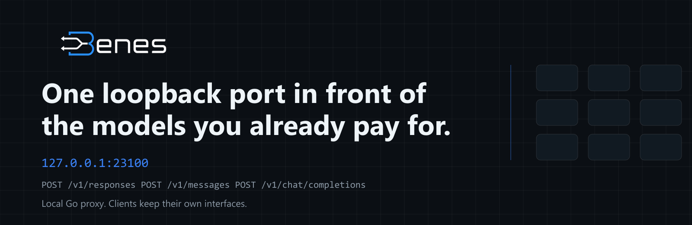
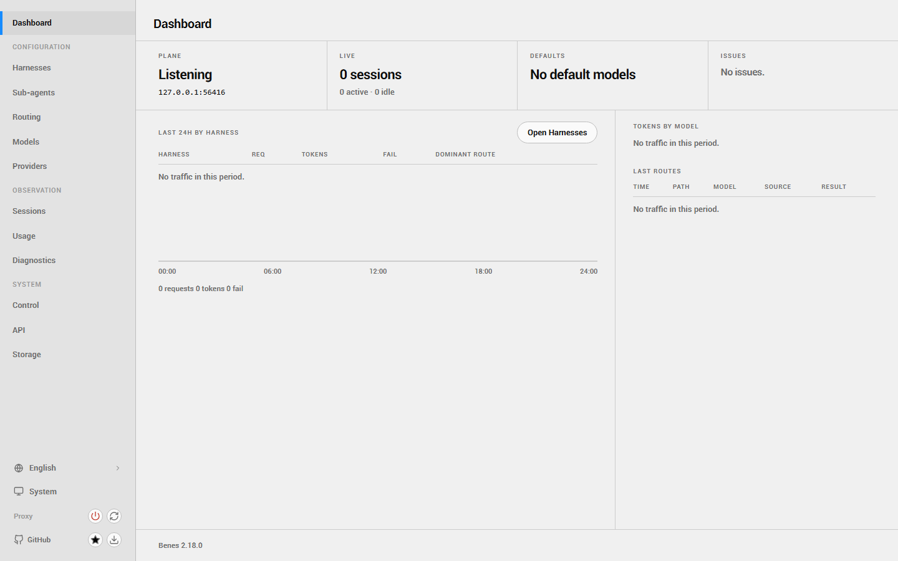
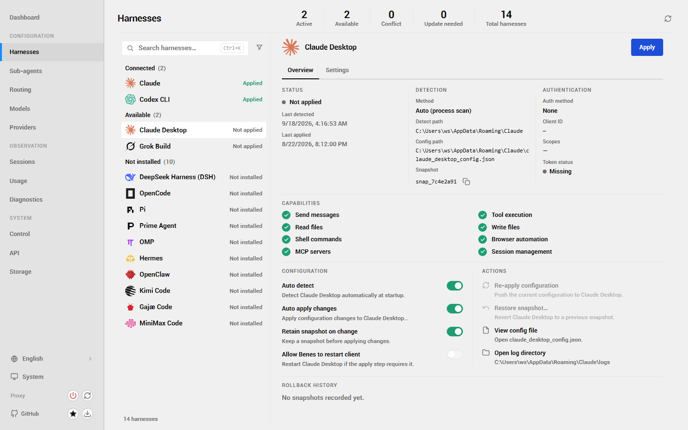
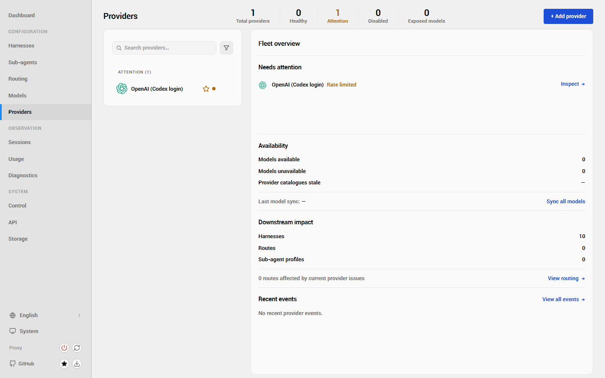
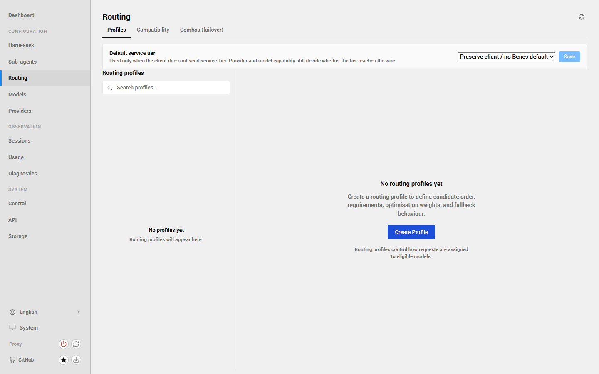
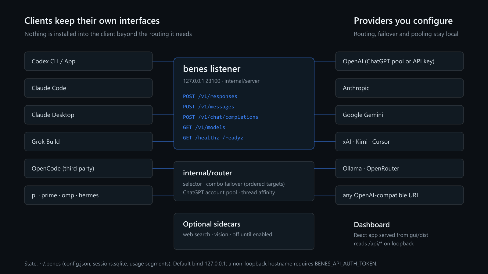
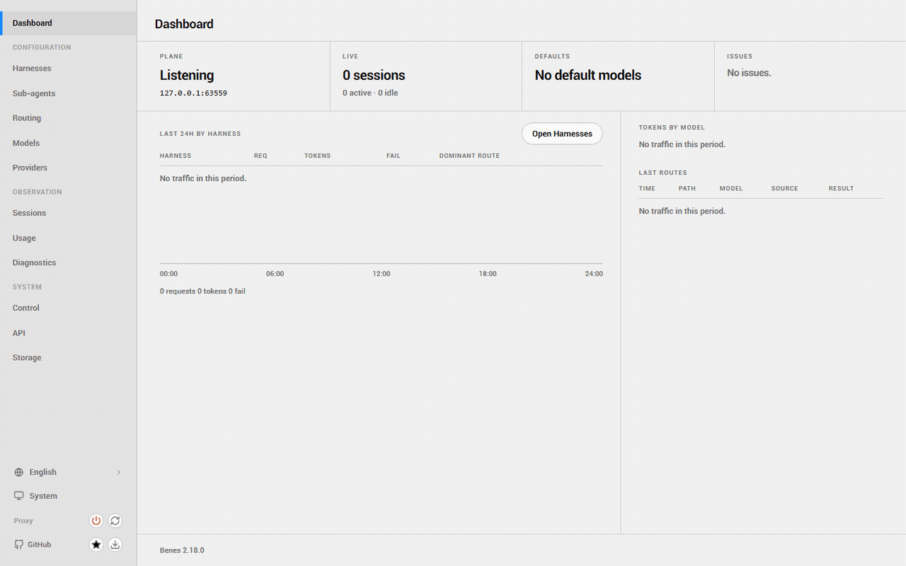

<p align="center">
  
</p>

<p align="center">
  <a href="https://www.npmjs.com/package/benes"></a>
  <a href="https://github.com/Wibias/Benes/blob/main/LICENSE"></a>
  
</p>

benes is a **Go proxy on loopback**. Codex, Claude Code, Claude Desktop, Grok Build, and other clients keep their own interfaces; the listener on `127.0.0.1:23100` accepts OpenAI Responses, Anthropic Messages, and Chat Completions, and `internal/router` decides which provider answers.

```bash
npm install -g @wibias/benes
benes start        # data plane plus dashboard on 127.0.0.1:23100
```

<table align="center">
  <tr>
    <td width="50%" align="center">
      <br>
      <sub><b>Dashboard</b> — plane status, live sessions, defaults, and what needs attention.</sub>
    </td>
    <td width="50%" align="center">
      <br>
      <sub><b>Harnesses</b> — which client integrations are applied, available, or not installed.</sub>
    </td>
  </tr>
  <tr>
    <td width="50%" align="center">
      <br>
      <sub><b>Providers</b> — adapters, access lanes, quotas, and status for every entry.</sub>
    </td>
    <td width="50%" align="center">
      <br>
      <sub><b>Routing</b> — profiles, compatibility, and failover combos over the same model catalog.</sub>
    </td>
  </tr>
</table>

<p align="center">
  📖 <a href="./docs/src/content/docs/start/install.md"><b>Documentation source →</b></a>
</p>

Default bind is `127.0.0.1:23100`; state lives under `~/.benes` unless `BENES_HOME` points elsewhere. The listener does not rewrite Codex config unless you ask it to: `benes start` leaves `config.toml` alone, `--inject` or `benes sync` writes the routing, and `benes stop` puts the native file back from the injection journal.



## What it does

- **Route anything you configured.** `provider/model` selects a candidate up front; a bare id uses the default provider or a name match. Inner slashes in upstream ids are published with `-` as well, and the raw slash form still works. [Model ids](./docs/src/content/docs/use/model-ids.md)
- **Pool ChatGPT accounts.** The `openai` preset can hold several accounts. A new session takes a healthy one and normally keeps it; quota pressure, fail-closed auth, and 401/403/429 recovery can rebind. `openai-apikey` never joins the pool.
- **Combos are failover.** A combo id expands to an ordered target list, and the projector walks it until one succeeds. Omitting the strategy means failover; anything else is rejected as `unsupported_strategy`. [Combos](./docs/src/content/docs/use/combos.md)
- **OAuth or a pasted key.** `benes login` runs the flows that need a browser. Key presets take a secret. Durable config writes are transactional, and the mutation log stores rows with secrets stripped.
- **Sidecars stay optional.** Web search and vision live under `internal/sidecar` and are off until a configuration enables them. [Sidecars](./docs/src/content/docs/use/sidecars.md)
- **Spawn roster.** `benes agent subagents` and `benes v2` decide which models Codex may spawn, including fallback chains. [Sub-agents](./docs/src/content/docs/use/sub-agents.md)
- **Clients launch against the same port.** `benes claude`, `benes grok`, `benes opencode` (the third-party [OpenCode](https://opencode.ai) client, not this project), `benes mcode`, `benes zcode`, plus `benes export` for a client config.
- **Undo.** `benes stop` and `benes restore` put Codex back from the injection journal.

## Quick start

### Humans

```bash
npm install -g @wibias/benes   # Node 18+ and Go 1.27.0; the launcher execs the Go CLI
benes start            # or `benes service` to keep it running in the background
```

Open **http://127.0.0.1:23100** and configure providers, models, and accounts in the dashboard. `benes gui` reopens it at any time, and starts the listener if it is not running.

<details>
<summary>Run from source</summary>

```bash
git clone https://github.com/Wibias/Benes.git
cd Benes
go run ./cmd/benes start
```

The same commands work on Windows in PowerShell. A source checkout runs the current tree; the npm tarball is the released CLI plus the built dashboard from `gui/dist`.

</details>

### Agents

```bash
npm install -g @wibias/benes
benes start     # or `benes service`
benes init      # writes ~/.benes/config.json, may inject Codex, never starts the listener
```

`benes init` and `benes start` can run in either order. Live verbs — `benes provider add`, `benes combo set`, and friends — talk to the running process and fail when it is unreachable. `benes status`, `benes health`, and `benes ready --wait` report liveness and post-sync readiness.

> **Installing or running benes as an agent?** Read [For agents](./docs/src/content/docs/start/agents.md) first. An interactive `benes start` may print one dim line about starring this repository: that decision belongs to the user, and the CLI suppresses the prompt for agent-driven runs. `POST /api/github/star` without a dashboard session is `403 consent_required`.

## Dashboard



Boards cover the fleet (providers and their access lanes), models and visibility, routing and combos, harnesses, sub-agents, sessions, usage, diagnostics, storage, and the API surface. Everything the dashboard shows comes from the same state the CLI uses, over loopback `/api/*`. [Dashboard](./docs/src/content/docs/use/dashboard.md)

## Codex integration

`benes sync` (or `benes start --inject`) writes routing into the resolved Codex home, so Codex CLI, the TUI, the app, and SDK clients share one injected configuration, and the routed models appear in the model picker next to native ones. `BENES_SKIP_CODEX_INJECT=1` skips injection even when `--inject` is passed. `benes restore` undoes the Codex side without a running proxy, and `benes stop` restores it as part of shutting down. [Codex](./docs/src/content/docs/use/codex.md)

## Model ids

```bash
codex -m "anthropic/claude-sonnet-4-6" "summarize this diff"
codex -m "google/gemini-2.5-pro" "write tests for auth.go"
codex -m "ollama/llama3" "refactor this function"
```

`GET /v1/models` keeps the OpenAI list shape and adds capability metadata (context window, tool use, vision, reasoning ladders) from the same catalog state that routing uses. Unknown values are omitted rather than guessed. [Model ids](./docs/src/content/docs/use/model-ids.md)

## Providers

`internal/server/provider_presets.json` ships 81 presets: OpenAI (ChatGPT login or API key), Anthropic, Google Gemini, xAI, Kimi, Azure OpenAI, Ollama local and Cloud, Cursor, and the OpenAI-compatible long tail. Any other endpoint can be added with its own base URL. [Providers](./docs/src/content/docs/use/providers.md)

## Health and readiness

`GET /healthz` answers immediately when the process is alive. `GET /readyz` answers with a sanitized identity (`service`, `version`, `uptime`, `pid`, `port`, `status`): `200` once `status` is `ready`, and `503` with `Retry-After: 1` while it is `pending` or terminally `failed`. Neither route is authenticated, and neither exposes more than that.

`benes ready` probes once; `--wait` polls for up to 45 seconds by default and exits immediately on a terminal `failed`; `--timeout <seconds>` (1–300, requires `--wait`) bounds it. `--json` prints `{ready, status, pid, port}`.

| Exit | Meaning |
| --- | --- |
| `0` | Ready |
| `1` | Not ready: pending, failed, timeout, or unreachable |
| `64` | Invalid arguments |

A listener too old to serve `/readyz` fails closed as `unreachable` with exit 1, while `benes health` keeps working.

## Autostart: service or shim

`benes service` installs a listener that starts at login and restarts on crash — a launchd user agent on macOS, a systemd user unit on Linux, and Task Scheduler on Windows (`benes service install --native` uses WinSW instead). `benes codex-shim install` starts the listener the first time `codex` launches, with no daemon at all. Remove either with its `uninstall` verb. [Install](./docs/src/content/docs/start/install.md)

## Remote bind

`127.0.0.1` is the default hostname. Setting `"hostname": "0.0.0.0"` makes the process refuse to start unless `BENES_API_AUTH_TOKEN` is set, and every client then sends that value as `x-benes-api-key`. [Config](./docs/src/content/docs/reference/config.md)

## CLI

```bash
benes init                        # durable config, optional Codex routing and shim
benes start [--port] [--inject|--no-inject]
benes stop                        # pid-file stop, then restore native Codex
benes service [status|start|stop|install|uninstall|repair]
benes codex-shim [status|install|uninstall|remove]
benes status                      # proxy state and Codex routing, separately
benes health | ready [--wait]     # liveness and post-sync readiness
benes gui | dev                   # dashboard, or Vite HMR on 23200
benes provider | models | agent | combo | alias | route | access | client | export
benes doctor                      # local snapshot
benes update                      # prints the update policy; never mutates the install
```

An unpinned `start` may hop to another free port when 23100 is taken; an explicit `--port` never hops. [CLI reference](./docs/src/content/docs/reference/cli.md)

## Docs and contributing

The public site is built from [`docs/`](./docs); start at [Install](./docs/src/content/docs/start/install.md). Contributor setup is in [`CONTRIBUTING.md`](./CONTRIBUTING.md), the PR contract in [`docs/src/content/docs/contributing/pr-quality.md`](./docs/src/content/docs/contributing/pr-quality.md), and security reports go through [private reporting](https://github.com/Wibias/Benes/security/advisories/new) as described in [`SECURITY.md`](./SECURITY.md).

```bash
git clone https://github.com/Wibias/Benes.git
cd Benes
go test ./...
go vet ./...
npm run build:gui
```

## Disclaimer

benes is an independent project. OpenAI, Anthropic, and the other vendors it can route to did not build or endorse it.

Some vendors — Anthropic among them — may restrict accounts that send API traffic through another process. Read the terms that apply to your account before connecting it, and treat the decision as yours. The Benes maintainers are not responsible for actions an upstream provider takes against an account.

## License

MIT
